class: center middle

# Hi :-)

---

# The Lighter Side of Dark Design

## Using Dark Design patterns (for good!) in Agile UX practice.

Jonathan Berger, 2015

Agile Experience Design
SpooOOOOooooky October Meetup, 2015

---

# What is "Dark Design"?

---

# Dark != Evil

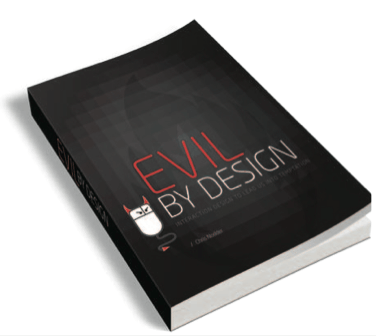

???

- Chris Nodder wrote this nice book
- outlines lots of evil patterns

---

# Dark Design is a *technique*, not a value claim

---

class: greenbg

### Case study:

# cops & witness identification

---

# the client

- philanthropic foundation
- focused on social justice
- "how can we do the most good?"

---

# What's the most bad?

--

class: warning

.f1[death-row inmates subsequently exonerated by DNA evidence]

---

# Leading cause?

--

- Jailhouse snitching

--

- Faulty witness ID

???

- lots of social science wrt bias, lineups
- easy to study? who cares!
- spare innocent people from death row!

---

# the app

--

- Cops create a lineup

--

- Witnesses pick the suspect out of the lineup

--

- Court sees witness ID firsthand

???

- remember that movie "The Usual Suspects?"

---

class: small-image

## What do you think of when you hear "lineup"?

--

class: center

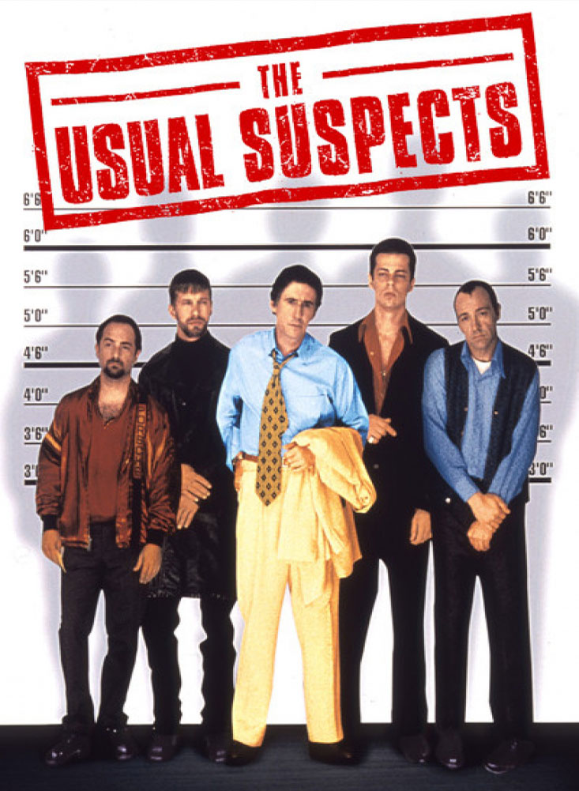

???

- This is many ppl think of when we hear "lineup"
- "Simultanous array"

---

class: warning

### e.g.,

# Let's say You're a witness to a crime: a man snatches a bag and runs off.

???
- cop interviews witnesses
- they want to ID the suspect
- one suspect photo, the rest are "filler"

---

## Simultaneous Array vs. Sequential Array

- In simultaneous lineups, witnesses must use "relative judgment" to compare lineup photographs to **each other**.

- For sequential lineups, witnesses must exercise "absolute judgment," comparing each photograph to their **memory of the offender**.

.right[[National Institute of Justice](http://www.nij.gov/topics/law-enforcement/investigations/eyewitness-identification/pages/simultaneous-sequential.aspx)]

---

class: small-text

> Investigated the effectiveness of sequential lineup presentation as a means of reducing false identifications with little or no loss in accurate identifications.

> A crime was staged for 240 unsuspecting eyewitnesses (undergraduates) either individually or in pairs. One-fourth of the Ss attempted identifications in each of 4 lineup conditions: 6 pictures were presented either simultaneously, as used in traditional procedures, or sequentially, in which yes/no judgments were made for each picture; each procedure either contained the photograph of the criminal–confederate or a picture of a similar looking replacement.

> Results indicate that sequential lineup presentation significantly reduced false identifications but did not significantly influence correct identifications when compared with a simultaneous procedure. **It is concluded that sequential presentation of lineups can reduce false identifications of innocent suspects by reducing eyewitnesses' reliance on relative-judgment processes.**

> .right[[Improving eyewitness identifications from lineups: Simultaneous versus sequential lineup presentation.
Lindsay, R. C.; Wells, Gary L.
Journal of Applied Psychology, Vol 70(3), Aug 1985, 556-564.](http://dx.doi.org/10.1037/0021-9010.70.3.556)]

???

- here is a fancy citation
- it says sequential lineups are better

---

class: warning

# Witness description

> White male, middle aged, dark hair. Medium height, medium build.

---

## Simultaneous Array

--

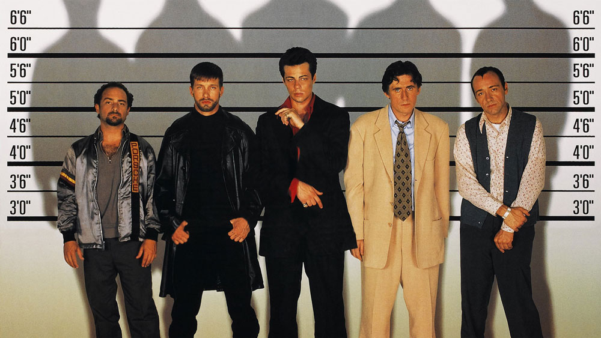

---

## Simultaneous Array

- Each face is compared to each other
- **Closest to witness memory** is selected

---

## Sequential array

- Each face is compared against witness memory
- Fewer false identifications

---

class: center, warning

### Do you recognize this man?

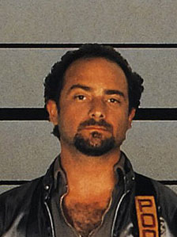

---

class: center, warning

### Do you recognize this man?

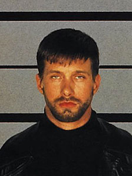

---

class: center, warning

### Do you recognize this man?

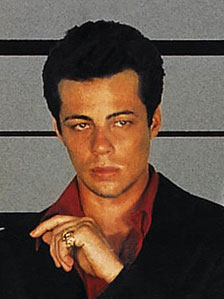

---

class: center, warning

### Do you recognize this man?

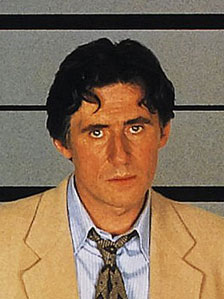

---

class: center, warning

### Do you recognize this man?

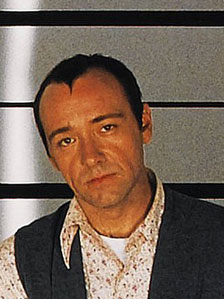

---

class: warning

.f3[Do you recognize this man?]

.f1[Yes! I recognize him!]

--

.f3[How do you know him?]

.f1[I saw him commit the crime!]

--

.f3[Are you sure?]

.f1[mmm...I think so. Wait, I'm not sure. No, ok, it looks like him.]

---

class: inverse

### Dark Design Pattern #1:

#introduce an app to make the preferred behavior the default behavior

???

- Encourage police to use sequential arrays.
- even though people may be averse to change
- build the app; make it easier to do the right thing than wrong

---

class: warning

# We've got a lead!

--

- There've been a rash of similar crimes in the area

--

- Police have a suspect

---

class: image-100

# Suspect Selection

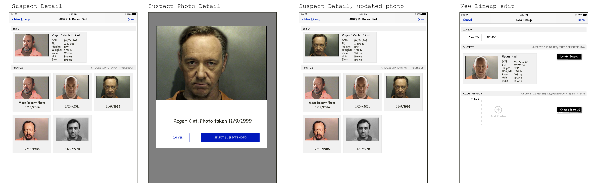

---

class: small-image

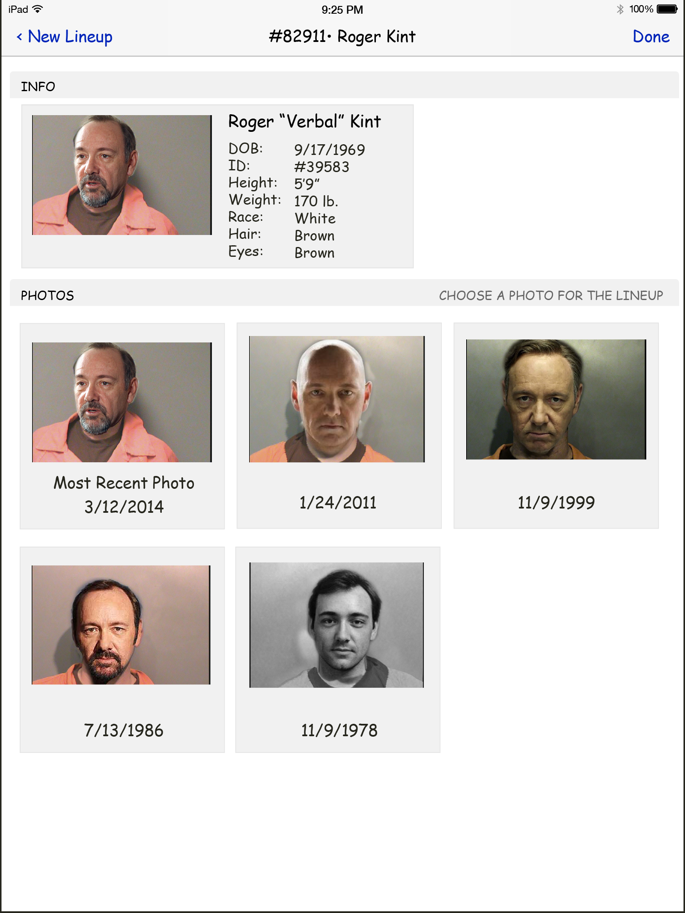

???

- this guy has a record
- most recent photo has goatee
- we want to match the witness description

---

class: small-image

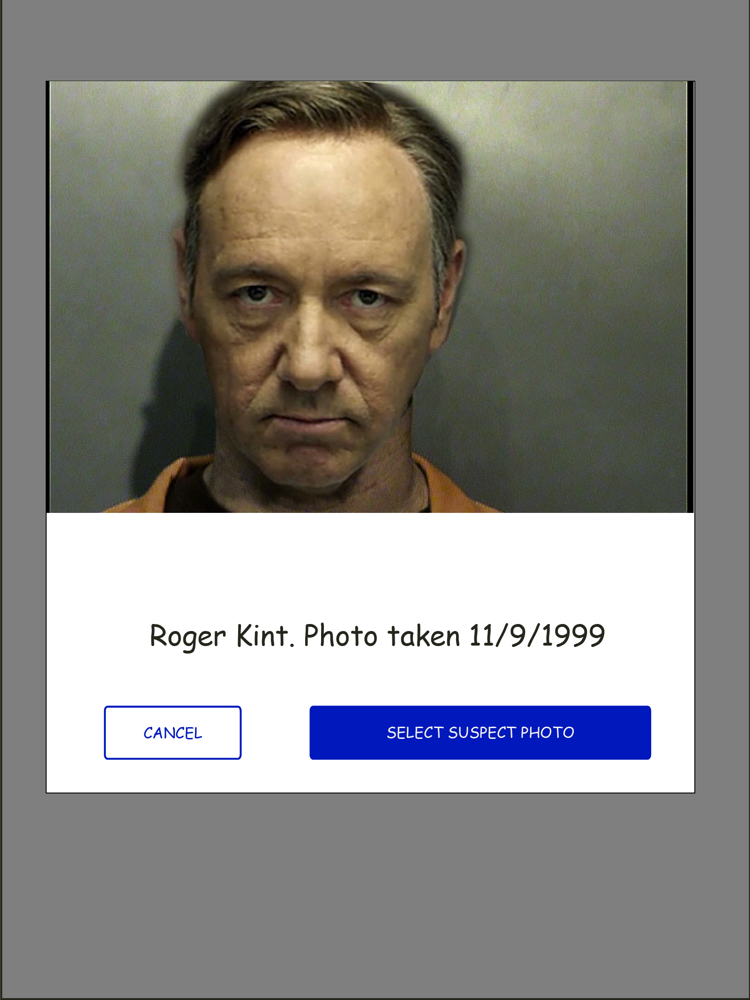

???

- choose older photo

---

class: small-image

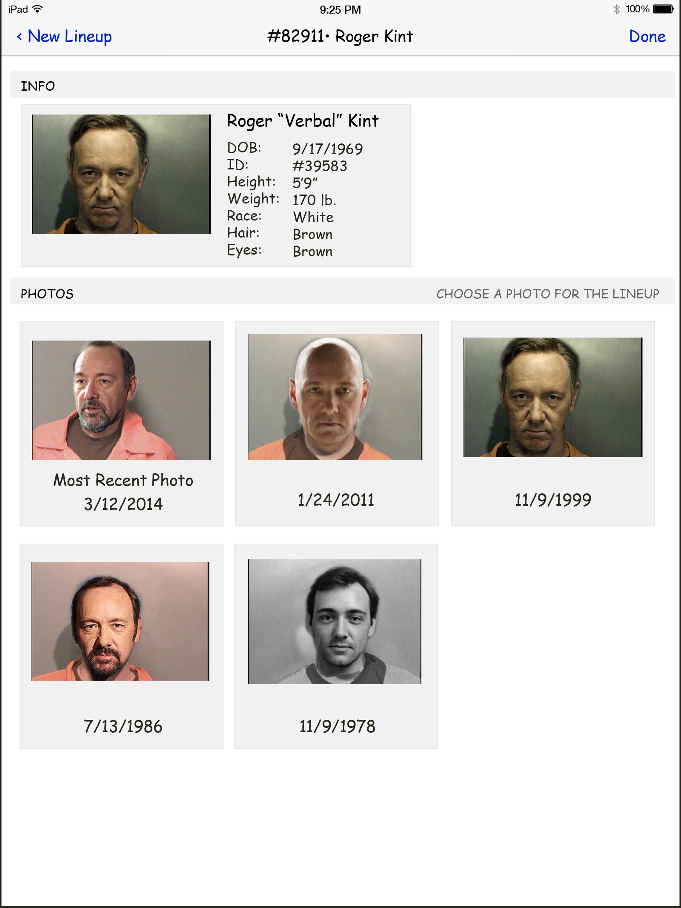

???

- less "accurate" photo is better: dark!

---

class: small-image

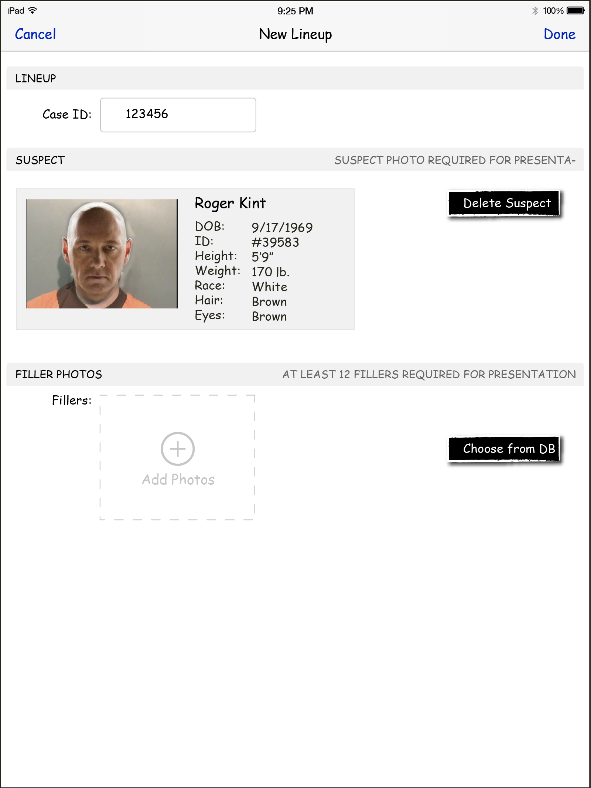

---

# Filler Selection

- identical twins: too close
- clearly different race or gender: too far
- where's goldilocks?

---

class: small-image

## Select filler photos

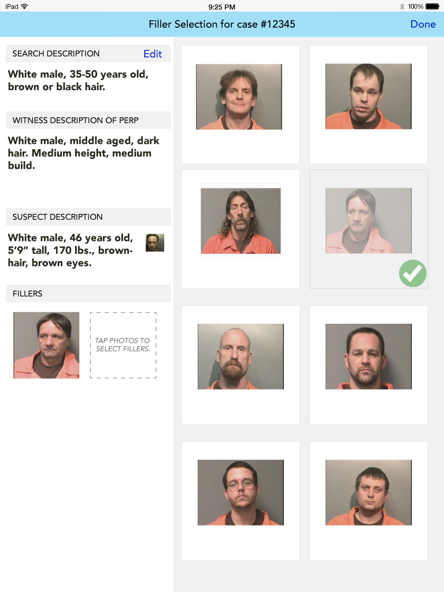

???

- based on **witness description**, not suspect picture

---
class: small-image

## Review suspect photo

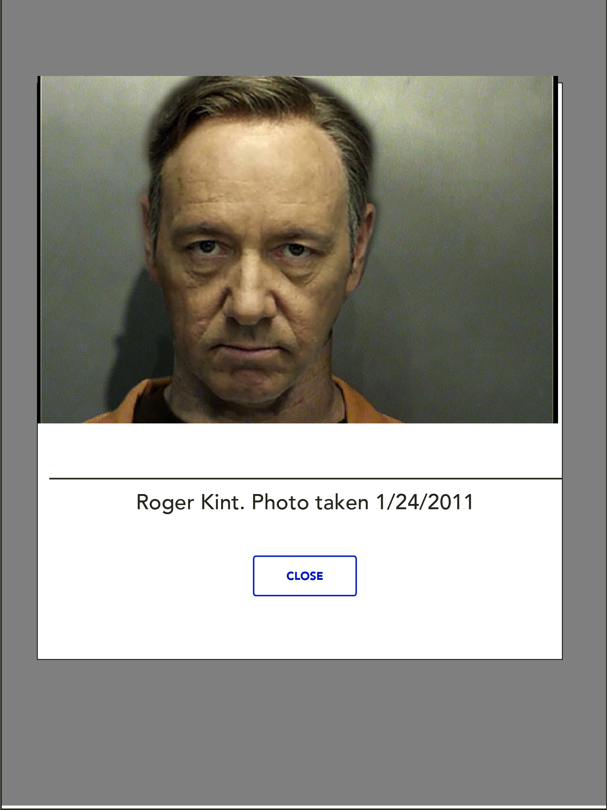

???

- it's a modal; can't see the filler pics

---

class: inverse

### Dark Design Pattern #2:

# Don't show photo

- select filler photos based on description, not (subjective) photo comparison
- science says its better
- similar opportunities to follow science when various descriptions (witness(es), suspect, etc.) conflict.

---

# The old way

???

- cop interviews witness, can shape recollection (memory can be faulty)
- cop testifies, judge hears the cop's version (confidence can be overstated)

---

# The better way

???

- blind administrator
- cop gives witness ipad, impartial repeatable instructions
- judge sees the witness give testimony

---

class: small-image

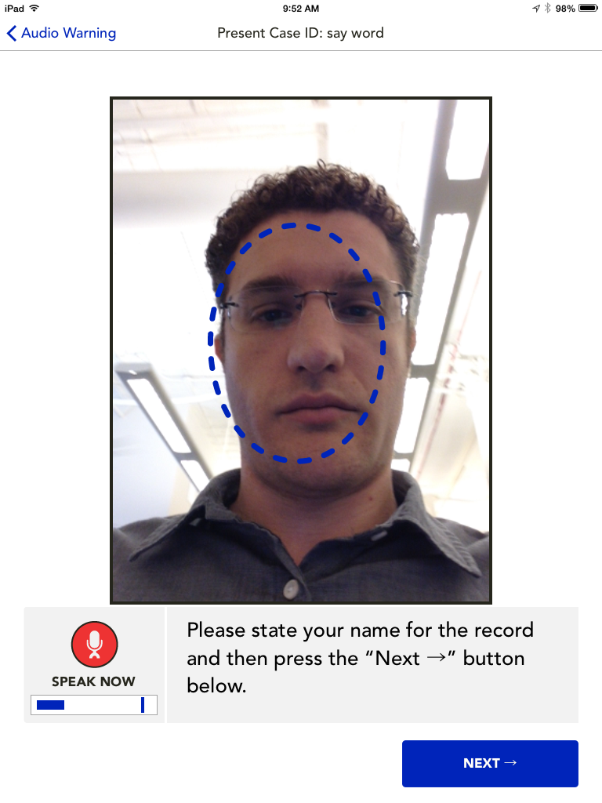

---

class: small-image

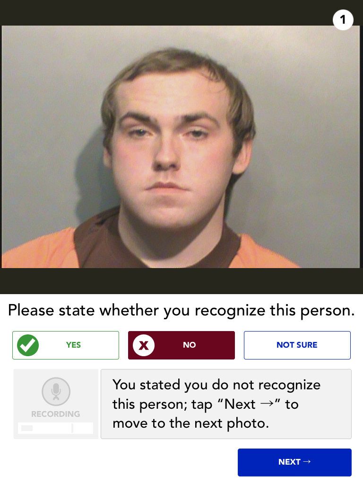

---

class: small-image

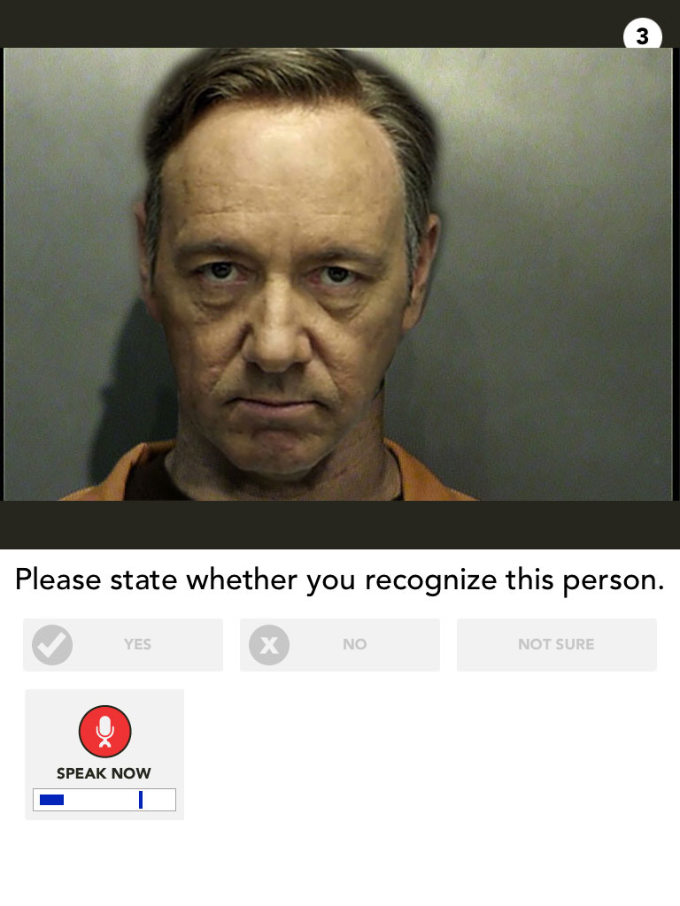

---

class: small-image

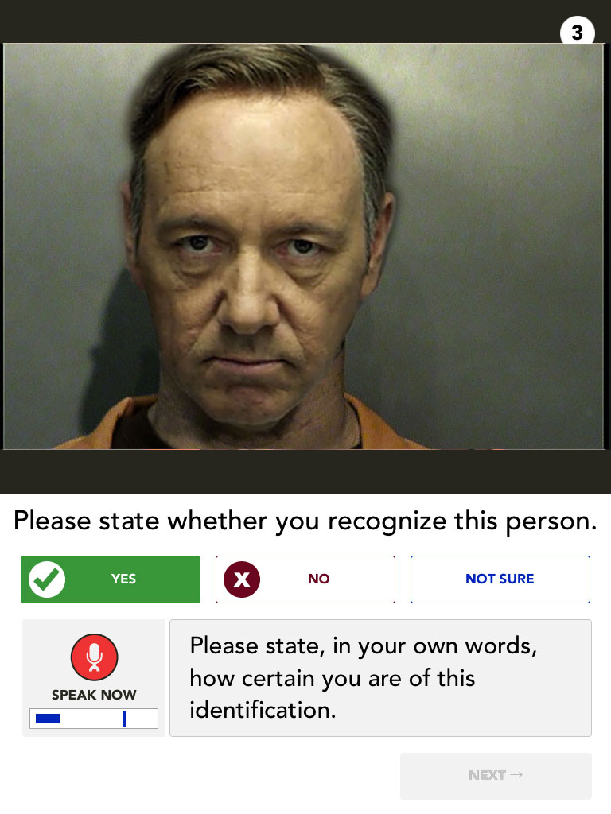

---

class: small-image

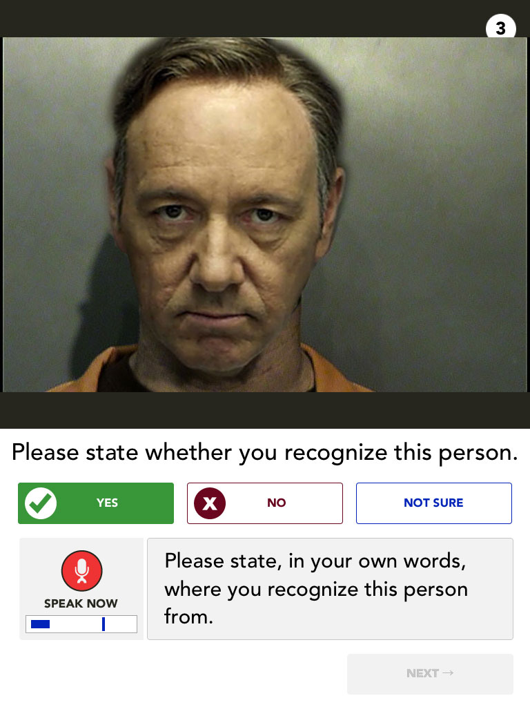

---

class: inverse

### Dark Design Pattern #3

# Testimony w/o officer influence

---

class: greenbg

# Conclusion

--

- .f2[Dark design is a technique (not a value claim)]

--

- .f2[It's not always bad]

--

- .f2[DON'T BE EVIL!!]

---

# Thanks!

- <http://jonathanpberger.com/talks>
- Say hi on twitter at `@jonathanpberger`
- or `jonathanpberger` on github, twitter, gmail, etc...

