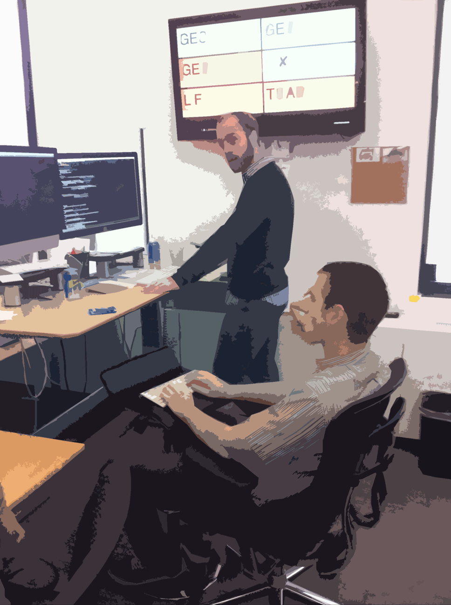
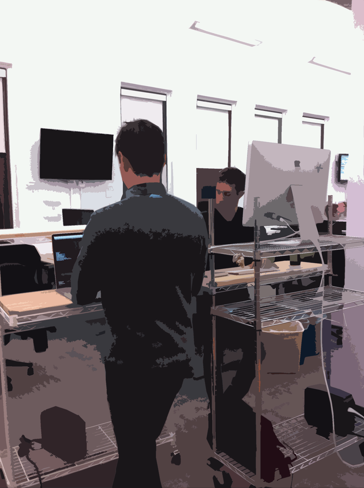
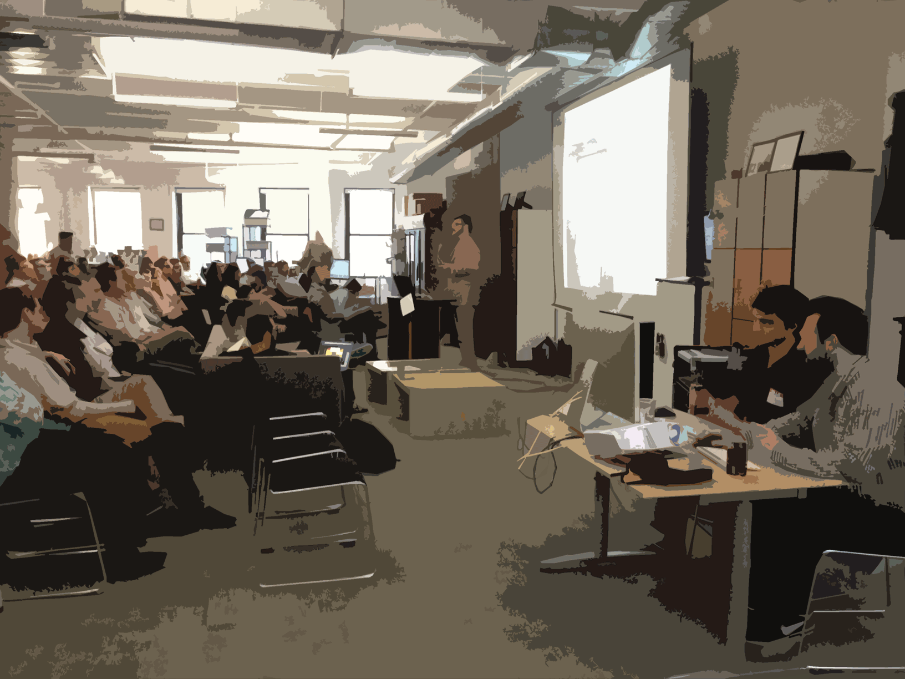
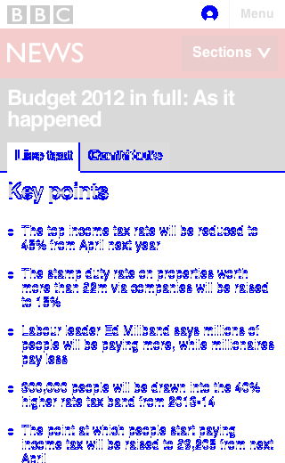
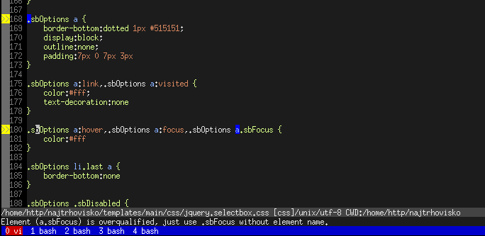
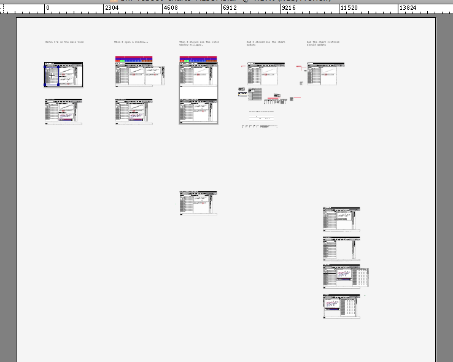
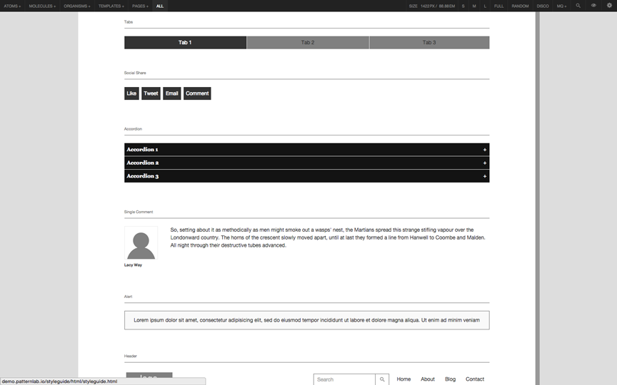

class: center middle

# Hi :-)

---

# Towards a Theory & Methodology of <br /> Test-Driven Design <br />(and: Pair-design!!)

Jonathan Berger, 2015

Agile2015

---

.f1[Who Am I?]

- [@jonathanpberger](http://jonathanpberger.com)
- design, code, pm
- ~30 agile projects since 2008
- interested in agile practice for design

---

.f1[What hurts in Design?]

--
.de-em-list[

- **"Is the design done?"** How will we know?
- **"What's the most important design to work on?"** Who decides?
- **"Does this work as a design *system*?"** Is our design system intact?
- **Communicating design** to teams of mixed expertise
- **Broken process** or no process at all
]

???

- Unsustainable pace
- Changing requirements
- "Seagull" management
- Low-fidelity communication => not knowing/agreeing on what to design
- Doing unnecessary work / designing the wrong thing
- working working working and then NEVER releasing

---

.de-em[.f3[SPOILER ALERT:]]
--
<br/>
.de-em[.f3[Agile helped engineers with similar problems.]]
--
<br/>
<br/>
<br/>
.f1[Agile can help designers too!]

---
class: center, middle

.f1[Origin Story]

???

- started as a self-taught designer,
- found Agile and fell in love,
- because it addressed a lot of these problems


---

class: center, middle

.f1[I witnessed Agile making engineers happy]

???


- productive too

---
class: inverse, center, middle
.f1[how does that work?]

---

.f1[Pairing enables happiness]

--

- because we're social mammals
--

- fight distraction, gain focus (your pair doesn't care about your facebook page)
--

- we're already [starting to pair-design][]. How do we pair *more*?

---

.f1[Test-Driving enables pairing]

--

- because it answers "what should we do now?"
--

- and "why should a client pay for two people to work on this?"
--

- ping-pong pairing

---

.f1[so...]

--

- if agile enables happiness,
--

- and pairing enables agile,
--

- and test-driven development ("TDD") enables pairing,
---

class: middle, inverse

.f1[How do we enable .green[TDD], <br/>which enables .green[Pairing], <br/>which enables .green[Happiness], <br/>for Design?]


???

- LET THIS QUESTION HANG
- talk about "happy devs" as a goal for the Ruby language

---

# Agenda

I. What we talk about when we talk about Pair Design

II. What are the benefits of TDD?

III. How does TDD work?

IV. How could we Test-Drive Design?

---

class: center, middle, warning

## WARNING: "Testing" is a messy word.

???

- In the design context, it usually means User Testing
- User Testing is a part of this, but we're talking about a lot more

---

class: center, middle, warning

.f2[Testing .de-em[vs.] User Testing .de-em[vs.] Test-Driving]

---

class: center, middle, inverse

# I. What we talk about when we talk about "Pair Design"

---

class: imagecell

## What does pairing look like?

|                                                |                                          |                                                  |                                                        |                                                |
| -                                              | -                                        | -                                                | -----------------                                      | ------------                                   |
| Pairing at scale                               | Synth / Gen                              | Sitting/Standing                                 | Design Office Hours                                    | Hurricane Sandy                                |
|  |      |  |  |  |
| Remote Pairing                                 | design pair                              | "tete-a-tete"                                    | Stunt Pairing                                          |                                                |
|    |  |            |              |                                                |

---

# How is design different for Agile?

- engineers build quickly, change rapidly
- demands different than what designers are accustomed to
- execution + enablement

---

## How to make design for agile successful?
- focus on the right questions
- keep pace with engineers
- build beautiful, functional product
- enable clients to do the same

---
class: center, middle

# Why Pair Design?

---
## Better (Product) Design
- reduce the cost of change
- encourage convention, reduce trivial decisions
- reduce waste


---

## Better Designers
- promotes learning
- knowledge-transfer
- continuous improvement

---

## Better Teams
- help teams start from shared foundation
- make decisions collaboratively
- externalize and validate thinking

---

## Better Projects
- fresh eyes
- mesh complementary skill sets
- better Bus Count
- easier ramp-up
- facilitate rotation

---

## Better Product
- optimize for progress (not perfection)
- remove individual ego
- promote shared ownership of product

---

# How do we Pair design?

- similar techniques and philosophies as engineering
- design is different BUT
- core principles of communication, tight feedback loops
- Pair design takes a few forms. The three major standbys are:

---

## "Synth/Gen" Whiteboard pairing

- two people, one marker (cursor)

---
class: imageslide


- two people, one marker (cursor)
- "Generator" has marker in hand, generate ideas
- "Synthesizer" stands back, asking, probing, edge cases, big picture

---
class: imageslide


- map out feature sets or user-flows at about the epic level of granularity.

---

## Medium-Fidelity Illustrator Pairing

- when whiteboard-fidelity is no longer sufficient to make design decisions

---
class: imageslide


- two visual designers building a Visual Design System

---
class: imageslide


- i.e. building a visual metaphor for the object domain that they're mapping onto the product

---
class: imageslide


- two mice plugged into one copy of illustrator
- trade off control of the cursor

---
class: imageslide


- designers discuss the design challenge
- occasionally turn to the computer
- test out a feeling, illustrate an idea, or enshrine a decision.


---

## Stylesheet Pairing
- often called "cross-functional pairing"
- that's a misnomer

---
class: imageslide


- two designers in the text editor, in the browser
- working on markup

---
class: imageslide


- enshrine design decisions
- implement them on the front end of the site

???

Pairing also introduces advantages which aren't available to solo design.

- When designing in front of working software (rather than static mock-ups), designers are able to generatively experiment and design in real-time.
- They can play more easily and natively with interactions, make changes at full-fidelity, and be creative in a way that's impossible in a mock-up.

## Cross-functional pairing

- difference w/ cross functional pairing:
- 2x designers pairing together == some skill transfer but similar perspective
- designer + developer == a lot more skill transfer,

---

## Benefits of Cross-Functional pairing

- no need to reproduce the design in mock-ups (time-consuming)
- no time spent marking up (for designer) and decoding (for developers) redlines
- developer learns the rationales behind the design decisions
- designer & dev move from adversarial context to collaborative context
- better unit cohesion, better bus-count, better collective ownership

---

# When do we pair?

- Dev == 100% pairing, design <100%
- Pairing is valuable whenever design decisions are being made
- documenting decisions made by the pair: divide and conquer (2x speed for the dull stuff!)

---

## Switch-hit pairing

- two projects, two designers
- solo mostly, but have context
- support each other when decisions need to be made
- block out ~1hr / day

---
class: center, middle

.f2[Testing .de-em[vs.] User Testing .de-em[vs.] Test-Driving]

---

class: center, middle, inverse

# II. The Benefits of TDD

---

class: de-em-list

## Benefits of TDD (for product)

- **Allows "done" to be defined** by non-programmers (e.g. using Gherkin "Given/When/Then" stories)
- **Fights scope creep** by preventing over-engineering. You're just trying to make this test pass.
- **Allows a constant health-check**, (i.e., Continuous integration) so you know when the app is broken. Business (not technology) decides when to ship.
- **Lowers the cost of change** so product decisions can iterated on quickly and safely

???

These are all critical to lean practice

---

class: de-em-list

##  Benefits of TDD (for teams)
- **Standardizes workflow** so as to lower bus-count risk, the cost of training, and the cost of learning new things
- **Helps any teammember quickly understand** what's going on (including new teammembers or Future You)
- **Provides live documentation** that never lies (c.f. "Comments are lies waiting to happen")
- **Allows for refactoring** (implementation changes, outcome doesn't)
- **Improves (API) interfaces and software design**, enforcing SOLID principles, Law of Demeter, etc.

???

- get away from Ninja Rock Star, towards repeatable empirical scientific methods
- "Improves design" is analogous to consistency, using a grid, etc.


---

class: center, middle, inverse

# II. How does TDD work?

---
class: middle
.f3[A TDD example: ]

# Hamazon.com

???

We're going to talk about my favorite website


---

background-image: url(images/hamazon.png)

???

we'll start w/ a story

---

## Our User Story

.f2[`User should be able to add Item to Shopping Cart`]

???

- We're pairing,
- I'll write the test & you make it pass


---

### Write in Gherkin

Gherkin looks a lot like regular English, but with a few magic words:

- **"Given",**
- **"When",**
- **"And",**
- **"Then".**

---

### Write the Test

```ruby
Given I am a loggedin User
When I go to the Item Page
And I tap the "Add Item to Cart" button
Then I should see the Cart Inventory increment
And I should see the Cart Sub-Total increment
And I should see the Warehouse Inventory decrement
```

---

### Rules of Testing

- Test is readable by the computer
- Each line will fail or pass individually

---
class: center, middle
## TDD Credo: ".red[Red], .green[Green], Refactor"

---

### Write a .red[Red] Test

.green[`Given I'm a logged-in User`]

.green[`When I go to the Item Page`]

.red[`And I tap the "Add Item to Cart" button`]

???

- already written *User login*
- already written *Item Page*
- but there is no button

---

### Now make it .green[Green!]
- Go into the part of the codebase which has front-end HTML views
- find the `Item Page`
- add a `<button>Add Item to Cart</button>`

---
class: center, middle, inverse
.f1[That's it.]

???

- No mucking with the database.
- The button isn't hooked up to anything.
- just trying to make the test pass, line by line.

---
### Run the test again:

.green[`Given I'm a logged-in User`]

.green[`When I go to the Item Page`]

.green[`And I tap the "Add Item to Cart" button`]

.red[`Then I should see the Cart Inventory increment`]

---

.f3[What next?]

- connect the `<button>` to the database
- `Cart Inventory` should increment
- run the test again

---
layout:true
### Run until done

.green[`Given I'm a logged-in User`]

.green[`When I go to the Item Page`]

.green[`And I tap the "Add Item to Cart" button`]

---

.green[`Then I should see the Cart Inventory increment`]

---

.green[`Then I should see the Cart Inventory increment`]

.red[`And I should see the Cart Sub-Total increment`]

---

.green[`Then I should see the Cart Inventory increment`]

.green[`And I should see the Cart Sub-Total increment`]

.red[`And I should see the Warehouse Inventory decrement`]

---
layout: false
class: middle, center
# The Story is Done!

.de-em[(Refactor as necessary)]

???

What next?

---
class: center, middle

# Running the Test Suite

---

## Now run ALL our tests, together
- All features (e.g. Login, Item Page) have tests
- This test is .green[green], but run the Test Suite
- Did this feature break anything?

???

- take a few minutes, stretch our legs

---
class: center, middle, warning

## We broke suite!

???

- we broke part of the warehouse management system
- cheaper to fix it now

---

## Fix (& Refactor)!

- Fix (often refactor) our code
- (Write additional tests as necessary)
- Repeat until green.
- Push to production

---

class: middle, center, interlude

.f1[What's Refactoring?]

???

You might've heard the word as MysteryDevIncantation to goof off

---

class: middle, center, interlude

.f2[Changing the .green[implementation] while maintaining the .green[outcome].]

???

Think about that idea in the context of **design systems**

---
class: center, middle

## So what does the test suite gain us?

---

class: center, middle

# Continuous Integration

.f2[a perpetual .green[health] .red[check] for your project]

???

**Continuous Integration** is often the delivery vector for this health check

---

## <s>F**k it,</s> Ship It!

- Mitigate technical risks
- Deployment is a purely business decision

???

this is crucial for *lean product development* & *testing hypotheses*

---

class: center, middle

.f2[.de-em[A brief note on] Types of tests]


???

- GUI, integration, unit
- tests can drive out other tests
- provides a model for breaking down a big activity {dev,design}
- testing pyramid describes ratio
- more later

---

class: center, middle, inverse

# III. How could we <br/> Test-drive design?

---

name: csstest
### People are working on CSS Testing

<http://CSSTe.st> catalogs a number of techniques for testing CSS

### Tend to be focused on a few approaches

1. Screenshot Diff'ing
2. Unit Testing CSS
3. Linting

---

### 1. Screenshot Diff'ing

.de-em[Examples using [Wraith][wraith] and [CSS Critic][csscritic]]

.left-column[]
.right-column[

]

---

### 2. Unit Testing CSS
.de-em[example using [Hardy.io][hardy]]

```ruby
Feature: Website layout test
As a user I want visual consistency on the http://csste.st/ website

Scenario: Content layout
Given I visit "http://csste.st/"
Then "section > p" should have "color" of "rgb(68, 68, 68)"
```

---

### 3. Linting
.de-em[example using [CSS Lint][csslint]]



???
could be a good health check

---

class: center, middle
### These are all very practical and tactical

---

class: center, middle
### What's missing?

---

class: middle, center, inverse

.f1[Design!]

???

- These are concerned with testing CSS rather than testing *design*.

---
class: center, middle, greenbg

# Test *DESIGN*, not just implementation
???

- these steps are crucial
- necessary but not sufficient

---
name:methodology
class: center, middle, inverse

# Methodology of TDDesign

<!-- this could be a place for# <Interlude>: TDD & Pairing -->
<!-- this could be a place for# <Interlude>: Ping Pong Pairing -->

???

So what's the design equivalent?

---
class: center, middle

## What would the Literal Interpretation for TDDesign look like?

???

- we looked at Automated design testing tools earlier
- can we test-DRIVE with them?

---

### Image Diff test-driving

- Red Test: Mockup vs. Screenshot of implementation
- Green Test: Image diff passes

Worth it? Maybe for responsive or X-browser? Style-Guide Driven Design?

???

---

### Unit-Testing CSS test-driving

- Hardy, Quixote, Cactus, etc. could do this
- Tedious to write the tests
- what's the correlation between Design Decisions and CSS rules?

Worth it? Sometimes, especially to protect against regressions

---

### Linting

- Not sure that test-driving applies at all

---

class: middle
.f2["Process changes are much more profound then the technology that enables them."]

<br/>

—[John Albin Wilkins, Style-Guide-Driven Development: the new web development](https://www.previousnext.com.au/blog/style-guide-driven-development-new-web-development)

???

---

class: center, middle

# What if we Focus on .green[process], not just .red[technology]?

---
class: center, middle

# practical examples

.de-em[.f3[How can TDD thinking help different types<br/> {FE, VxD, UI, UX} of design?]]

<!-- interlude: types of design -->

---

### VxD & UI: BDD-Driven Mock Flows

```ruby
As a User
When I go to...
Then I should see...
```



???

see also Google Ventures' [Story-Centered Design][scd]

---

### UI & FE: Live Style Guides & Compliance

Style-Guide-Driven Design, [Hologram][]



???
- style-guide driven design
- [Stylecop][] can ensure compliance with [hologram][]
- Pivotal Labs is doing some very cool work right now w/ PUI

---

### UX: Including the user
- Persona.yml
- UserTesting.com, Ethn.io
- Lean Hypotheses

???

- Persona.yml makes personae Acceptance Criteria
- UserTesting.com, Ethn.io could be ways to automate via machine
- Hypotheses set up acceptance crit

---

class: center, middle

# How can techniques inform the bigger picture?

---
name: automation
class: center, middle

## To go from "Testing" to "Test Driving", ask

.f2["(How) can this plug into an Automated .green[Health] .red[Check]?"]

???
- the first thing we need to do is start breaking builds
- socialize the notion of a transparent heath check
- team agrees on, done means done

---

class: center, middle, inverse
# (Testing) Pyramid Scheme

???

- different kinds of tests
- test pyramid history: from QA, inverted
- for our purposes: a model of how different tests fit into the picture

---
background-image: url(images/testing-pyramid.png)
class: center, middle
.f1[The Testing Pyramid]

---

name:dev-pyramid

### Development Testing Pyramid
| Strategy Name     | Typical Tool | Testing What? | How Many? |
| ----------------- | ------------ | ------------- | --------- |
| Acceptance Tests  | Cucumber     | GUI           | 1         |
| Integration Tests | Rspec        | API           | 10        |
| Unit Tests        | Rspec        | Methods       | 100       |

---

name:design-pyramid

### Design Testing Pyramid

| Type   | Strategy Name                   | Possible Tool                  | Testing What?            | For every&hellip; | Order of Magnitude |
| -----  | ----------------------------    | ------------------------------ | ------------------------ | ----------------- | -----              |
| UX     | Test Testing                    | [Persona.yml][yml]             | Persona/TDD Integrity    | Persona           | •                  |
| UX     | User Research                   | [Ethn.io][ethnio]              | Product-market fit       | Persona           | ••                 |
| FE     | Cross-Viewport Testing          | [Browserstack][browserstack]   | Responsive Consistency   | Viewport          | ••                 |
| FE     | Screenshot Diff'ing             | [Wraith][wraith]               | Styleguide Compliance    | Component         | ••                 |
| VxD    | Computed Style Unit Testing     | [Hardy][hardy]                 | Ontological Integrity    | Decision          | ••                 |
| VxD    | CSS Unit Testing                | [Quixote][q]                   | Ontological Integrity    | Decision          | ••                 |
| UI,VxD | Styleguide-Driven Dev't         | [Stylecop][stylecop]           | Ontological Integrity    | Decision          | ••                 |
| UI     | Usability Testing               | [Usertesting][usertesting]     | Usability                | Interaction       | ••                 |
| UX     | [Story-Centered Design][scd] CI | **[BUILD ME! :-)][red-ci]**    | Flow Coverage            | User Flow         | ••                 |
| FE     | Cross-Browser Testing           | [Browsershots][browsershots]   | X-browser Consistency    | Browser           | •••                |
| ALL    | BDR Testing                     | **[BUILD ME! :-)][red-ci]**    | Defining 'Done'          | Story             | •••                |
| FE     | Screenshot Diff'ing             | [Wraith][wraith]               | Screen Regressions       | Screen            | •••                |
| FE     | Linting                         | [CSSLint][csslint]             | Code Consistency         | Line              | •••                |


---
name: next
class: inverse
# What's Next?
- Explore where TDD ideas can help design practice
- Socialize the idea of Design Health Check in CI
- Continue to improve testing tools

---

# Thanks!

- <http://jonathanpberger.com/talks>
- Say hi on twitter at `@jonathanpberger`
- or `jonathanpberger` on github, gmail, forrst, etc...

---
class: center, middle

# Bonus!

---
name: resources
## Resources

| Concept                                              | Resource                                                                                                   |
| ---------------                                      | ----------------------------------------------------                                                       |
| Atomic Design                                        | <http://bradfrost.com/blog/post/atomic-web-design/>                                                        |
| Big Design Refactor                                  | <http://pivotallabs.com/big-design-refactor>                                                               |
| CSS Testing                                          | <http://csste.st>                                                                                          |
| Design Backlog                                       | <http://pivotallabs.com/manage-design-backlog/>                                                            |
| Pattern Lab                                          | <http://patternlab.io/>                                                                                    |
| PivotalUI testing video                              | <http://http://original.livestream.com/pivotallabs/video?clipId=pla_5a76d100-ea64-4552-9d44-15078c26ace5/> |
| Story-Centered Design                                | <https://www.gv.com/lib/story-centered-design-hacking-your-brain-to-think-like-a-user>                     |
| Style Guides                                         | <http://styleguides.io/>                                                                                   |
| Style-Guide Driven Design                            | <http://uxmag.com/articles/anchoring-your-design-language-in-a-live-style-guide>                           |
| Towards a Theory & Methodology of Test-Driven Design | <http://jonathanpberger.com/talks>                                                                         |

---

## MOAR!! Links
.small[
```
[boulder]: https://twitter.com/jonathanpberger/status/562926708949803010
[atomic]: http://bradfrost.com/blog/post/atomic-web-design/
[bdr]: http://pivotallabs.com/big-design-refactor
[fixtures]:http://en.wikipedia.org/wiki/Test_fixture
[csscritic]:http://cburgmer.github.io/csscritic/
[phantomcss]: https://github.com/Huddle/PhantomCSS
[hologram]: http://trulia.github.io/hologram/
[browsershots]:http://browsershots.org/
[usertesting]:http://www.usertesting.com/
[ethnio]: http://ethn.io/
[browserstack]: http://browserstack.com
[yml]:https://github.com/jonathanpberger/persona_dot_yml
[stylecop]: https://github.com/pivotal/style_cop
[wraith]: https://github.com/BBC-News/wraith
[csslint]:https://github.com/CSSLint/csslint
[hardy]:http://hardy.io/
[q]:https://github.com/jamesshore/quixote
[red-ci]: https://twitter.com/jonathanpberger/status/563123069435535361
[scd]: https://www.gv.com/lib/story-centered-design-hacking-your-brain-to-think-like-a-user
[design backlog]: http://pivotallabs.com/manage-design-backlog/
[spandrels]:http://en.wikipedia.org/wiki/Spandrel_%28biology%29
[cargo cult design]:https://twitter.com/hashtag/CargoCultDesign?src=hash
[xp-explained]:http://www.amazon.com/Extreme-Programming-Explained-Embrace-Edition/dp/0321278658
```
]

[boulder]: https://twitter.com/jonathanpberger/status/562926708949803010
[atomic]: http://bradfrost.com/blog/post/atomic-web-design/
[bdr]: http://pivotallabs.com/big-design-refactor
[fixtures]:http://en.wikipedia.org/wiki/Test_fixture
[csscritic]:http://cburgmer.github.io/csscritic/
[phantomcss]: https://github.com/Huddle/PhantomCSS
[hologram]: http://trulia.github.io/hologram/
[browsershots]:http://browsershots.org/
[usertesting]:http://www.usertesting.com/
[ethnio]: http://ethn.io/
[browserstack]: http://browserstack.com
[yml]:https://github.com/jonathanpberger/persona_dot_yml
[stylecop]: https://github.com/pivotal/style_cop
[wraith]: https://github.com/BBC-News/wraith
[csslint]:https://github.com/CSSLint/csslint
[hardy]:http://hardy.io/
[q]:https://github.com/jamesshore/quixote
[red-ci]: https://twitter.com/jonathanpberger/status/563123069435535361
[scd]: https://www.gv.com/lib/story-centered-design-hacking-your-brain-to-think-like-a-user
[design backlog]: http://pivotallabs.com/manage-design-backlog/
[spandrels]:http://en.wikipedia.org/wiki/Spandrel_%28biology%29
[cargo cult design]:https://twitter.com/hashtag/CargoCultDesign?src=hash
[xp-explained]:http://www.amazon.com/Extreme-Programming-Explained-Embrace-Edition/dp/0321278658
[starting to pair-design]:http://pivotallabs.com/benefits-of-pair-design/

---

# Thanks Again!

- <http://jonathanpberger.com/talks>
- Say hi on twitter at `@jonathanpberger`
- or `jonathanpberger` on github, gmail, forrst, etc...

---

name: pairing extras

# Pairing Extras!!

---

# Troubleshooting techniques: Soloing

---

## Converge / Diverge / Converge

- hit an impasse?
- diverge for a short time (usually 10-30 minutes) to work through ideas solo
- re-converge, presenting their explorations, and continuing to pair

---

## Exquisite Corpse

- surrealist literary parlor game
- short timer (usually 10-30m), work on a design direction, pass it off
- Or, forego timer and just say "ready?" when stuck
- Ideally, several revolutions each hour
- rapid iteration, idea generation, refinement

---

## Double-Speed Documentation

- Once made, design decisions often have to be documented.
- Design pairs will split up to create the [Minimum Viable][] [DRY documentation][].
- Because there are two designers, they deliver in half the time.

---


---

## Balanced Team & Pairing
- these are not existential claims
- It's not  "I am a developer I was born that way" or trained that way,
- it is "my role on this project developer or designer".

---

## Product people
- tend to be interdisciplinary
- first obligation: ensure backlog is healthy
- help conversation: "what do we need to do next? What does that look like? How's it enshrined?"

---

## Product Synth-Gen pairing
- When pairing with product designers via Synth-Gen
- strategic Step-Back, Higher- Level view of "How do these ideas comport with the rest of our system?"
- that's something that product for the most part can drop into any piece of

---

## Product Medium-Fidelity pairing
- Product tends to be good feedback for some of the illustrator pairing that we'll do
- less formally trained
- usually able to talk through user flows

---

## pairing links

### <http://pivotallabs.com/minimum-viable-deliverable/>
### <http://pivotallabs.com/dry-documentation>
### <http://pivotallabs.com/big-design-refactor/>


[Minimum Viable]: <http://pivotallabs.com/minimum-viable-deliverable/>
[DRY documentation]: <http://pivotallabs.com/dry-documentation>
[different rhythms]: <http://pivotallabs.com/big-design-refactor/>


