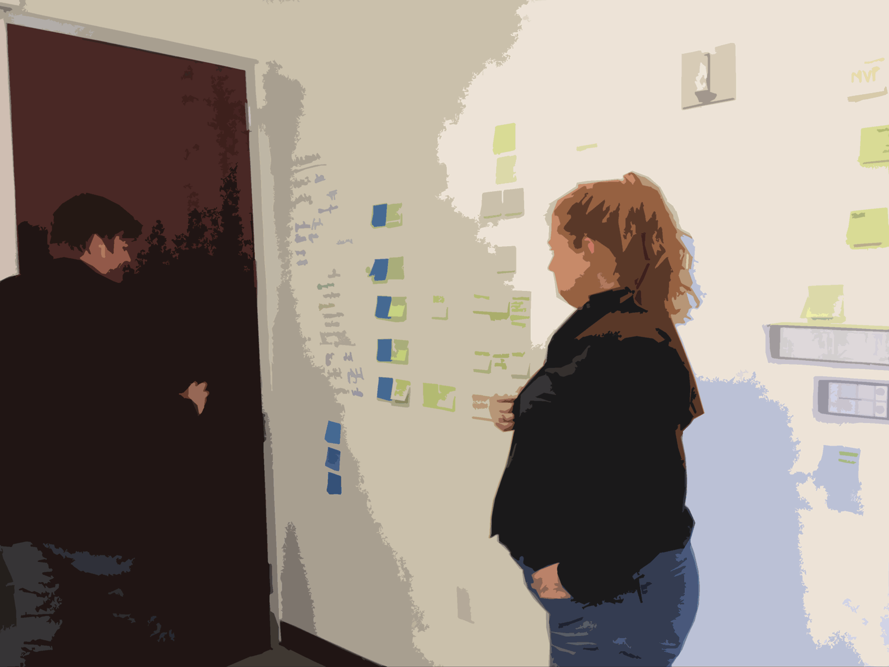

# TDD for Design Scratchpad

## TODO
- [√] CI earlier, as gateway drug
- [√] tie TDD to pairing frequency
- [√] mention PivUI
- [] add recap
   - happy
   - ci
- [√] roman numerals for sections
- [x] add purple .title? will it work w/ footer?
- [√] pain => tavern

---

# / FROM PAIRING TALK

**Hi :-)**

---

# Pair Design for Fun and Profit

# How is design different for Agile?

- engineers build quickly, change rapidly
- demands different than what designers are accustomed to
- execution + enablement

---

## How to make design for agile successful?
- focus on the right questions
- keep pace with engineers
- build beautiful, functional product
- enable clients to do the same

---

# Why Pair Design?

---

## Better (Product) Design
- reduce the cost of change
- encourage convention, reduce trivial decisions
- reduce waste

---

## Better Designers
- promotes learning
- knowledge-transfer
- continuous improvement

---

## Better Teams
- help teams start from shared foundation
- make decisions collaboratively
- externalize and validate thinking

---

## Better Projects
- fresh eyes
- mesh complementary skill sets
- better Bus Count
- easier ramp-up
- facilitate rotation

---

## Better Product
- optimize for progress (not perfection)
- remove individual ego
- promote shared ownership of product

---

# How do we Pair design?

- similar techniques and philosophies as engineering
- design is different BUT
- core principles of communication, tight feedback loops
- Pair design takes a few forms. The three major standbys are:

---

## "Synth/Gen" Whiteboard pairing

- two people, one marker (cursor)

---

- two people, one marker (cursor)
- "Generator" has marker in hand, generate ideas
- "Synthesizer" stands back, asking, probing, edge cases, big picture

---

- map out feature sets or user-flows at about the epic level of granularity.

---

## Medium-Fidelity Illustrator Pairing

- when whiteboard-fidelity is no longer sufficient to make design decisions

---

- two visual designers building a Visual Design System

---

- i.e. building a visual metaphor for the object domain that they're mapping onto the product

---

- two mice plugged into one copy of illustrator
- trade off control of the cursor

---

- designers discuss the design challenge
- occasionally turn to the computer
- test out a feeling, illustrate an idea, or enshrine a decision.

---

## Stylesheet Pairing
- often called "cross-functional pairing"
- that's a misnomer

---

- two designers in the text editor, in the browser
- working on markup

---

- enshrine design decisions
- implement them on the front end of the site

???

Pairing also introduces advantages which aren't available to solo design.

- When designing in front of working software (rather than static mock-ups), designers are able to generatively experiment and design in real-time.
- They can play more easily and natively with interactions, make changes at full-fidelity, and be creative in a way that's impossible in a mock-up.

## Cross-functional pairing

- difference w/ cross functional pairing:
- 2x designers pairing together == some skill transfer but similar perspective
- designer + developer == a lot more skill transfer,

---

## Benefits of Cross-Functional pairing

- no need to reproduce the design in mock-ups (time-consuming)
- no time spent marking up (for designer) and decoding (for developers) redlines
- developer learns the rationales behind the design decisions
- designer & dev move from adversarial context to collaborative context
- better unit cohesion, better bus-count, better collective ownership

---

# Troubleshooting techniques: Soloing

---

## Converge / Diverge / Converge

- hit an impasse?
- diverge for a short time (usually 10-30 minutes) to work through ideas solo
- re-converge, presenting their explorations, and continuing to pair

---

## Exquisite Corpse

- surrealist literary parlor game
- short timer (usually 10-30m), work on a design direction, pass it off
- Or, forego timer and just say "ready?" when stuck
- Ideally, several revolutions each hour
- rapid iteration, idea generation, refinement

---

## Double-Speed Documentation

- Once made, design decisions often have to be documented.
- Design pairs will split up to create the [Minimum Viable][] [DRY documentation][].
- Because there are two designers, they deliver in half the time.

---

# When do we pair?

- Dev == 100% pairing, design <100%
- Pairing is valuable whenever design decisions are being made
- documenting decisions made by the pair: divide and conquer (2x speed for the dull stuff!)

---

## Switch-hit pairing

- two projects, two designers
- solo mostly, but have context
- support each other when decisions need to be made
- block out ~1hr / day

---

# Extras!!

---

## Balanced Team & Pairing
- these are not existential claims
- It's not  "I am a developer I was born that way" or trained that way,
- it is "my role on this project developer or designer".

---

## Product people
- tend to be interdisciplinary
- first obligation: ensure backlog is healthy
- help conversation: "what do we need to do next? What does that look like? How's it enshrined?"

---

## Product Synth-Gen pairing
- When pairing with product designers via Synth-Gen
- strategic Step-Back, Higher- Level view of "How do these ideas comport with the rest of our system?"
- that's something that product for the most part can drop into any piece of

---

## Product Medium-Fidelity pairing
- Product tends to be good feedback for some of the illustrator pairing that we'll do
- less formally trained
- usually able to talk through user flows

---

# Pics (or it didn't happen)

---

## Pair Anywhere

---

- design office hours

---

- hurricane sandy

---

- stunt pairing

---

- remote pairing

---

## Pairing Arrangements

---

- sitting standing

---

- Tete-a-tete

---

- card sorting

---

- card sorting

---

## links

### <http://pivotallabs.com/minimum-viable-deliverable/>
### <http://pivotallabs.com/dry-documentation>
### <http://pivotallabs.com/big-design-refactor/>

[Minimum Viable]: <http://pivotallabs.com/minimum-viable-deliverable/>
[DRY documentation]: <http://pivotallabs.com/dry-documentation>
[different rhythms]: <http://pivotallabs.com/big-design-refactor/>

---
# / END PAIRING TALK

---

# Agile Manifest Principles => Problems Agile Solves

> Our highest priority is to satisfy the customer through early and continuous delivery of valuable software.

Customers aren't satisfied when product isn't delivered.

> Welcome changing requirements, even late in development. Agile processes harness change for the customer's competitive advantage.

Changing requirements hurts.

> Deliver working software frequently, from a couple of weeks to a couple of months, with a preference to the shorter timescale.

Infrequent delivery hurts.

> Business people and developers must work together daily throughout the project.

Lack of communication bw dev and bness hurts.

> Build projects around motivated individuals. Give them the environment and support they need, and trust them to get the job done.

Motivation wanes.

> The most efficient and effective method of conveying information to and within a development team is face-to-face conversation.

Low-fidelity comms hurt.

> Working software is the primary measure of progress.

Time is wasted on distractions.

> Agile processes promote sustainable development. The sponsors, developers, and users should be able to maintain a constant pace indefinitely.

Unsustainable pace hurts people and businesses.

> Continuous attention to technical excellence and good design enhances agility.

High cost of change is bad for business.

> Simplicity--the art of maximizing the amount of work not done--is essential.

Doing unnecessary work hurts.

> The best architectures, requirements, and designs emerge from self-organizing teams.

Seagull management hurts.

> At regular intervals, the team reflects on how to become more effective, then tunes and adjusts its behavior accordingly.

Sclerosis hurts.

---

## Shorter

### Things that hurt:

- Changing requirements
- Seagull management
- Low-fidelity (or lack of) communication
- Doing unnecessary work
- Infrequent delivery
- Sclerotic process
- Unsustainable pace

### The Result:
- Time is wasted on distractions
- Motivation wanes
- High cost of change is bad for business
- Customers aren't satisfied

---

# Notes from when I was sleeping

[x] multiple styles sheets? eg standard, jpb, etc.
[] less me
[] don't need so much bg
[] TAT and user testing. It's important but it's not this
[] set up Atoms vs bits, low cost of changes as new value
[] sections: Why, Thy, Methodology
[] Minimum Viable Deliverable => Decisions
[x] interlude onology? blog it first
    - Brad frost "systems not pages = > ontology"
[] blog fund'l insight: cost is maintaning not buliding design system

---

[x]  scope thy meth of testing

# Shower Notes

- Where does TDD fit into Think -> Make -> Check

---

- "I code and design" => describe TDD workflow in dev, set up "I want this for design. What might that look like?"

- subj/obj => design pyramid

- ghost story benefit: declaritive testing benefit: ontological design story is told in code. This is probably the top of the pyramid

- think about how dev test Pyramid involves rendered results vs declarative statements. how much is a priori? in dev, unit tests are declarative, closest to math, closest to a priori. In Design, it may be inverted.

- use a geo font w/ lots of triangles

---

#  From main file

---

# Software development had problems

- Sclerosis around processes and tools,
- Compulsive (CYA) documentation,
- Endless negotiation about targets and deliverables,
- A fixation on following an old plan in a new situation.

---

## Continuous Integration

the insight that great cost is not to write code; rather, the majority of technical cost lays in *maintaining* a codebase.

----

# 99 (Hypo)theses about Design Fears
not sure if this is part of the talk, a new version of the talk, or what. But I shuold go with it for a little while.
// maybe the dev part goes up in the bg on TDD, and the design parts can set up moving from TDD -> TDDesign

---

> "We believe [TYPE OF USER] has a problem [DOING THING]. We can help them with [OUR SOLUTION]. We'll know we're right if [CHANGE IN METRIC]."

---

We believe designers have a problem

*refactoring the messes of CSS that metastasize once a project gets past the early phases.*

We can help them with

## a tool that provides for refactoring CSS with impunity.

We'll know we're right

*if Latter-Day Stylesheets become less of a problem (we can test this on our own codebases).*

---

We believe designers suffer from

## unintended design regressions

(especially in responsive designs) when changes in one part of the codebase unexpectedly affect another.

We can help them with a tool that craws the whole app and announces if anything's changed.

---

We believe designers suffer from the

## *fear* of unintended design regressions,

never being 100% certain that new changes haven't broken old styling.

---

*We believe*

## designers have trouble defining "done", which makes it hard to set expectations, to communicate with teams, and to manage their own work.

*We can fix this *

with a practice of Test-Driven Design, where "done" can be INVESTED up-front.

*We'll know we're right*

if there're fewer client disapprovals, because expectations were better set up-front. We'll know we're right if life gets better for designers.

---

We believe developers lacked confidence that their code would continue to work in the face of a changing codebase. They fixed it by testing their code and running Continuous Integration tests. We know they're right because this is a growing practice among businesses and developers.

---

We believe developers suffered from an inability to safely refactor code for fear of breaking something. They fixed this with tests, and we know they're right because techniques like Red-Green-Refactor can become cornerstones of their practice.

<!-- 2 more: testable and hence modular, and "tests describe behavior" -->

---

We believe designers have a problem with the imprecision of the word "design". We can fix this by spreading a vocabulary with more subtle distinctions. We'll know we're right if expectations are better set because client and designer share a ubiquitous language.

---

# Ideal Workflow

### VxD
- designer designs new user_profile/show page
- creates a "test": screenshot
- developer implements feature
- run tests
  - screenshoot each page
  - image diff each screenshot against last version or design_tests

- (if PASS then NOTHING HAPPENS)
- if FAIL then
  - stop the line (e.g. break the CI build)
  -

### FE
- refactor some CSS
- run tests: screenshots are image-diff'd
- FAIL! user_profile/show looks different
- Was this a desired difference?
  - if YES: bless this new screenshot. Does this imply a Design Changelog?
  - if NO: fix it

- stop the line (e.g. break the CI build)
- look at what broke, fix the CSS

### UX
- design something new
- run tests
- if PASS then NOTHING HAPPENS
- if FAIL then
  - stop the line (e.g. break the CI build)
  -

---

# Notes from UX Sketch Camp

- Talk -> never given

- how do I practice?

- New Idea...I dho'nt have practice

- Q: content tricky or stories?

- A: How do we know when design phase is done?

## Testing Pyramid
- 1 Acceptance test for every
- 10 Intergration tests, for every
- 100 Unit tests

Test driven engineering

What's the design version of the testing pyramid?
Sketching?
Common language of done
holy grail
looking at design as a series of experiments
more than just pretty pictures

75% spot-on
10% crazy
15% eh

---

# From researching rhetoric

who: hi, I'm jon
origin story
  designer
  discovered agile
  want to bring it to design

what: agile
  what problems does it solve?
  how does it work?

what: agile problems
  sus'l pace
  better work
  focus on the right things

how?
  in dev:
    Pairing
    TDD
    CI

what's the design analogue?
  Pairing: working on it
  TDD: this talk!
  CI: this talk?!

--

who: back to my story
  came to Piv

what
  learned dev, PM

how does that work?
  TDD hamazon story

--

who: designers
what: solve agile problems
how: break it down into the design pyramid

conclusion

--

- intro, put up tree
- throw rocks
- get down

--

- pick an idea you know something about
- connect a bit of own story to the subject
- make passion and story universal
- start w/ universal, then move to my story
- how can we join together to combat the problem?

--

## 1. tell a story

## 2. create emotionally charged events

## 3. what can they do?

---

# From TDD Lunch Talk

## The Pain
- Conversation started w/ numerical formatting: neg numbers red w/ parens, positive numbers w/ green, etc (cactus would fix this)
- layout broke w/ an experimental class leaking out to another DOM element, absolute positioning broke a page (GO would fix this)

---

## The Plan
- spike on a screenshotting tool wraith / GO (try graham's branch) / huxley and choose one
- put a screenshotting tool into a new Design build
- put the Design Build onto the CI board
- put Acknowledger page under screenshotting test
- report back to Automated Design Test Working Group

---

## Errata
- How to connect to (live?) styleguide?
- Changing data will break tests. We'll need fixtures. Create a separate "design test" build?
- How to run separately? How often? Separate rake task?
- what about interactions? we're mostly talking about testing static design
- user testing: [ethn.io][]
- what are the outside-in patterns in design testing?
- Are we talking about TDDing? What does TDDing look like for design?
- how can we assert / protect the grid system? the type system?
- how to deal w/ dynamic, js-driving DOM? what about ember, angular, etc.?
- "Catastrophic cactus test": assert against total failure, e.g. cards collapsing to 0 width.
- TDD w/ GO: create a mock in the browser w/ firebug, use it as the reference for GO to run against

---

<!-- not sure where this goes ; do we need to talk about storywriting? maybe storymapping?-->
# I.N.V.E.S.T.

- Independent: maybe?
- Negotiable: yes!
- Valuable: yes!
- Estimatable: in theory, yes
- Small: maybe?
- Testable: working on that now

---

# What can Automated Testing bring to Design? [blog draft]

## Tools that're out there
- rspec-style assertion tools (e.g. cactus)
- image-diff tools (e.g. green_onion, wraith)

## Problems we need to solve
### Stylesheets grow into a mess
- I want to refactor this CSS, but I'm scared of introducing regressions
- I want to enforce code-style in my stylesheets (e.g. compel semantic DOM classes, i.e., use `@extends` in bootstrap)
- fail a test if `!important`

### Design Integrity
- are we on-grid?
- are we staying in our type system? lint

## Narrative integrity
- do our personas match our cuke suite?

## What should I build?
- which UI solution is better? (e.g. split-test UI; ethn.io)
- validating metrics: should I build this feature? Which feature should I build next? Did this feature help users?

---

# Remark.js Layout Test

## A - no layout

---
layout: true

## B - Layout True

---

## C - no layout

---

## D - no layout

---
layout: false

## E - Layout false

---

## F no layout

---

---

# Resources
[capybara-accessible]: https://github.com/Casecommons/capybara-accessible
[css-ratiocinator]: https://github.com/begriffs/css-ratiocinator
[csste.st]: http://csste.st/tools/
[ethn.io]: http://ethn.io
[green_onion]: http://intridea.github.io/green_onion/
[GrabThemAll]: https://addons.mozilla.org/en-US/firefox/addon/grab-them-all/
[huxley]: https://github.com/facebook/huxley
[idiomatic-css]:https://github.com/necolas/idiomatic-css
[idiomatic.js]: https://github.com/rwaldron/idiomatic.js
[persona_dot_yml]: https://github.com/jonathanpberger/persona_dot_yml
[symilaa]: http://rubygems.org/gems/symilaa
[wraith]: https://github.com/BBC-News/wraith

---

# Resource Conversations
[announcing Quixote on Reddit]: http://www.reddit.com/r/webdev/comments/2igzrs/hey_reddit_ive_been_working_on_a_prototype_for/
[Quixote hackathon final report]: http://www.letscodejavascript.com/v3/blog/2014/10/quixote_final

[Simon's CSS Testing talk - video]: http://thingsinjars.com/post/484/high-definition-css-testing/
[Simon's CSS Testing talk - slides]:http://csste.st/slides
[Simon as blog post]:http://www.creativebloq.com/css3/4-tools-automatic-css-testing-7133777

[UX Recipes (a nice list of types of design)]: https://github.com/uxrecipe/uxrecipe.github.io
[atomic design]:

simon:
List of tools, grouped by area

### Syntax
CSSLint
### Per-project
HTML Inspector
GhostStory => aka Hardy
###Reference Browser Comparison
Web Consistency Testing (MogoTest)
###Regression
Image Diff (CSSCritic)
Frozen DOM (cssert)
GhostStory

---

# Interludes

# Interlude: Why Do I Care?

---

class: interlude
## origin story

---

class: interlude
## background on this talk: tried to give it before, but wasn't ready

---

class: interlude
## What is design?

(people ask "did you design that shirt?")

---

class: interlude
# </EndInterlude>

---

class: interlude
# <Interlude>: TDD & Pairing

---

class: interlude
## Ping Pong Pairing
- How does it work?
- how would TDD help Design Pairing?

---

class: interlude
# </End Interlude>

---

layout: true

# [Agile Manifesto Principles][2]

???

We're not going to go through all of these

---

--

> - Our highest priority is to *satisfy the customer* through early and continuous delivery of valuable software.
--

- *Welcome changing requirements*, even late in development. Agile processes harness change for the customer's competitive advantage.
--

- *Deliver working software frequently*, from a couple of weeks to a couple of months, with a preference to the shorter timescale.
--

- Business people and developers must *work together daily* throughout the project.

---
layout: false

layout: true

.f3[ [Agile Manifesto Principles][2] (Continued) ]

---

--

> - Build projects around motivated individuals. Give them the environment and support they need, and *trust them* to get the job done.
--

- The most efficient and effective method of conveying information to and within a development team is *face-to-face conversation*.
--

- *Working software* is the primary measure of progress.
--

- Agile processes promote *sustainable development*. The sponsors, developers, and users should be able to maintain a constant pace indefinitely.
---

> - Continuous attention to *technical excellence* and good design enhances agility.
--

- *Simplicity*—the art of maximizing the amount of work not done—is essential.
--

- The best architectures, requirements, and designs emerge from *self-organizing teams*.
--

- At regular intervals, *the team reflects* on how to become more effective, then tunes and adjusts its behavior accordingly.

---

# core areas where TDDesign can help

link it up to the current work being done and what's missing

1. Brittle CSS could be linting
2. Regression-proofing could be wraith
3. Asserting decisions could be cactus
4. Defining done could be the missing bit. Automation? CI?

or, more abstractly, the problems are:

1. consistency
    + code (addressed by linting)
    + elements (addressed by style guides)

2. unintended regressions - FE
    + this is fundamentally slippage between asserting design and implementing design

3. ontological design - UI, VxD
    - in different contexts
        + cross-browser
        + responsive
        +
4. asking the right question - Product Design

---

# Late Night TODOs

~:700 - fix methodology section

- run-through

---

# TDDesign
  - [] 2 possible lessons:
  1. literal: BDD Screenshot design
  2. Automation! DoD!

  - [] use "benefits". May need to expand / refactor to build on previous (initial) mention of benefits.

- [] all interludes can be in Bonus section
- [√] might need to cover multiple types of testing when I talk about TDD in the first place; set up the testing pyramid

---

## Benefits of Test-Driven Development

>- It gives me **confidence** that my code does what I think it does
- It confers the **ability to refactor** code without the fear that I have broken something
- It encourages a testable, and hence **modular, design**
- The **tests describe the behaviour** of the code

[Paul Wilson](http://www.neo.com/2014/03/20/the-many-faces-of-test-driven-development)

---
## Wouldn't the Benefits of Test-Driving be nice for Design?

`s/code/product`

>
- It gives me **confidence** that my product does what I think it does
- It confers the **ability to refactor** product without the fear that I have broken something
- It encourages a testable, and hence **modular, design**
- The **tests describe the behavior** of the product

---

## Where did TDD come from?

> Kent Beck, who is credited with having developed or 'rediscovered' the technique, stated in 2003 that TDD encourages simple designs and inspires confidence.

  — <http://en.wikipedia.org/wiki/Test-driven_development>

???

---

name:fixtures
## A word about Fixtures

- Content changes make many of these techniques are brittle
- TDD has addressed this with Fixtures
- Some work on Design [Fixtures][fixtures] can help a *lot*

---

class: center, middle, inverse

## Automation is key

---
